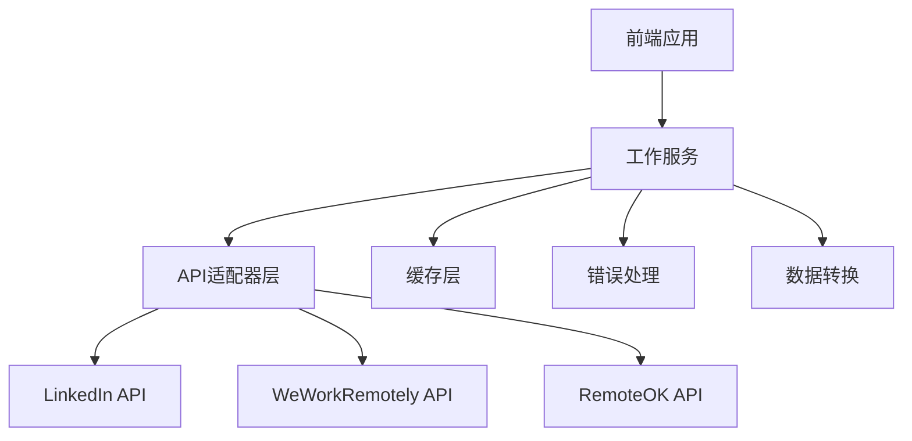
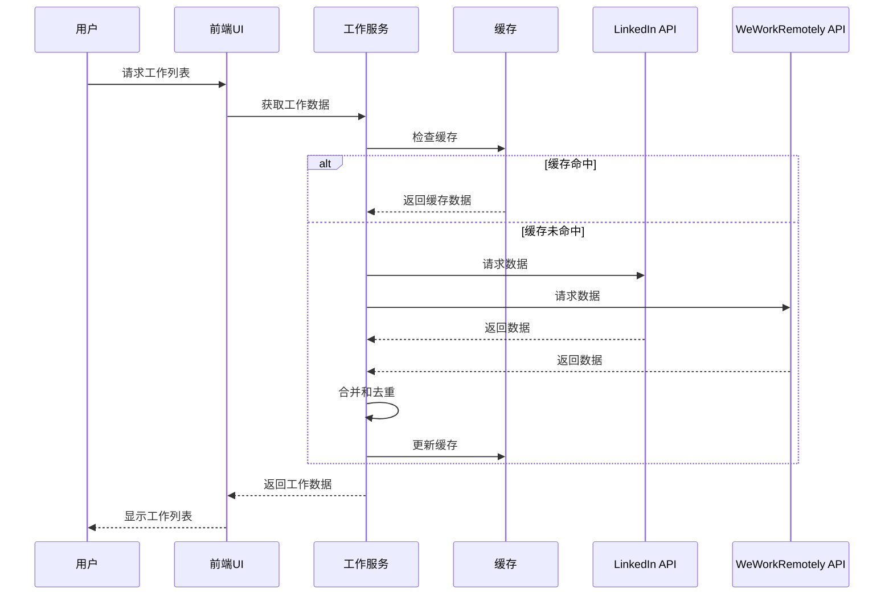

# 真实工作API集成设计文档

## 概述

本设计文档详细说明了如何将我们的远程工作网站与LinkedIn和WeWorkRemotely的API集成，以获取和显示实时工作数据。设计考虑了API限制、错误处理、数据整合和性能优化等方面。

## 架构

### 系统架构



### 数据流



## 组件和接口

### 1. API适配器

#### LinkedIn API适配器

```javascript
interface LinkedInJobsResponse {
  jobs: LinkedInJob[];
  paging: {
    count: number;
    start: number;
    total: number;
  }
}

interface LinkedInJob {
  id: string;
  title: string;
  company: {
    name: string;
    logoUrl: string;
  };
  location: string;
  description: string;
  listedAt: string;
  // 其他LinkedIn特定字段
}

class LinkedInApiAdapter {
  async fetchJobs(searchTerm: string, location: string, page: number): Promise<JobInfo[]>;
  async fetchJobDetails(jobId: string): Promise<JobDetail>;
}
```

#### WeWorkRemotely API适配器

```javascript
interface WWRJobsResponse {
  jobs: WWRJob[];
}

interface WWRJob {
  id: string;
  position: string;
  company_name: string;
  logo: string;
  tags: string[];
  job_type: string;
  publication_date: string;
  url: string;
  description: string;
  // 其他WWR特定字段
}

class WWRApiAdapter {
  async fetchJobs(searchTerm: string, category: string, page: number): Promise<JobInfo[]>;
  async fetchJobDetails(jobId: string): Promise<JobDetail>;
}
```

### 2. 工作服务

```javascript
interface JobService {
  async searchJobs(searchTerm: string, filters: JobFilters, page: number): Promise<JobSearchResult>;
  async getJobById(jobId: string): Promise<JobDetail>;
  async refreshCache(): Promise<void>;
}

interface JobSearchResult {
  jobs: JobInfo[];
  total: number;
  page: number;
  pageSize: number;
  sources: string[];
}

interface JobFilters {
  location?: string;
  category?: string;
  jobType?: string;
  salary?: {
    min: number;
    max: number;
  };
  postedDate?: string;
}
```

### 3. 缓存服务

```javascript
interface CacheService {
  get(key: string): Promise<any>;
  set(key: string, value: any, ttl: number): Promise<void>;
  invalidate(key: string): Promise<void>;
}
```

### 4. 错误处理服务

```javascript
interface ErrorHandlingService {
  handleApiError(error: Error, source: string): void;
  logError(error: Error, context: object): void;
  getErrorMessage(error: Error, fallbackMessage: string): string;
}
```

## 数据模型

### 统一工作数据模型

```javascript
interface JobInfo {
  id: string;
  title: string;
  company: string;
  companyLogo: string;
  location: string;
  type: string;
  salary: number;
  team: string;
  postedDate: string;
  views: number;
  applicants: number;
  description: string;
  skills: string[];
  source: string;
  sourceUrl: string;
  sourceId: string;
}

interface JobDetail extends JobInfo {
  minimumQualifications: string[];
  preferredQualifications: string[];
  aboutJob: string;
  companyInfo: string;
  benefits: string[];
  applicationUrl: string;
}
```

## 错误处理

### API错误处理策略

1. **重试机制**：对于临时性错误（如网络问题、服务器超时），实现指数退避重试
2. **降级策略**：当特定API不可用时，从其他可用API获取数据
3. **错误日志**：记录所有API错误，包括请求参数、响应代码和错误消息
4. **用户反馈**：向用户显示友好的错误消息，并提供刷新或重试选项

### 错误类型和处理方式

| 错误类型 | 处理方式 |
|---------|---------|
| 网络错误 | 重试3次，指数退避 |
| 认证错误 | 刷新令牌，如果失败则提示用户 |
| 速率限制 | 暂停请求，等待限制解除 |
| 服务不可用 | 切换到备用API或缓存数据 |
| 解析错误 | 记录错误，使用部分数据或备用数据 |

## 测试策略

### 单元测试

1. 测试每个API适配器的数据转换逻辑
2. 测试缓存机制的正确性
3. 测试错误处理和重试逻辑
4. 测试数据合并和去重算法

### 集成测试

1. 测试与实际API的集成（使用模拟服务器）
2. 测试完整的数据流，从API请求到UI显示
3. 测试错误场景和恢复机制
4. 测试性能和负载情况

### 模拟测试

1. 创建模拟API响应，覆盖各种数据场景
2. 模拟API错误和超时情况
3. 模拟缓存命中和未命中场景

## 实现细节

### LinkedIn API集成

LinkedIn API需要OAuth 2.0认证。我们需要：

1. 注册LinkedIn开发者应用程序
2. 获取客户端ID和密钥
3. 实现OAuth认证流程
4. 使用访问令牌调用Jobs API

API端点：
- 搜索工作：`https://api.linkedin.com/v2/jobs/search`
- 工作详情：`https://api.linkedin.com/v2/jobs/{id}`

注意：LinkedIn API有严格的使用限制，需要遵循其使用政策。

### WeWorkRemotely API集成

WeWorkRemotely提供RSS feed，我们将使用RSS2JSON服务将其转换为JSON格式：

1. 获取RSS2JSON API密钥
2. 构建请求URL，包含WeWorkRemotely RSS feed URL
3. 解析返回的JSON数据

API端点：
- RSS feed：`https://weworkremotely.com/categories/{category}/jobs.rss`
- 通过RSS2JSON：`https://api.rss2json.com/v1/api.json?rss_url={encoded_rss_url}`

### 数据转换和规范化

为了统一不同来源的数据格式，我们需要：

1. 创建数据映射函数，将API特定格式转换为我们的统一模型
2. 处理缺失字段，提供合理的默认值
3. 规范化日期、位置和工作类型等字段
4. 提取和标准化技能标签

### 缓存策略

为了优化性能和减少API调用，我们将实现：

1. 内存缓存，用于短期存储（5分钟）
2. 本地存储缓存，用于长期存储（1小时）
3. 基于搜索参数的缓存键生成
4. 缓存过期和自动刷新机制

### 性能优化

1. 并行API请求，使用Promise.all同时调用多个API
2. 实现虚拟滚动，只渲染可见的工作卡片
3. 延迟加载工作详情，只在用户查看时获取
4. 压缩和优化API响应数据

## 安全考虑

1. 安全存储API密钥和令牌
2. 实现CORS策略，防止未授权的API访问
3. 验证和清理API返回的数据，防止XSS攻击
4. 限制API请求频率，防止滥用

## 部署和监控

1. 设置API使用监控，跟踪调用次数和错误率
2. 实现健康检查，定期验证API可用性
3. 配置警报，在API出现问题时通知
4. 记录详细的API调用日志，用于调试和优化